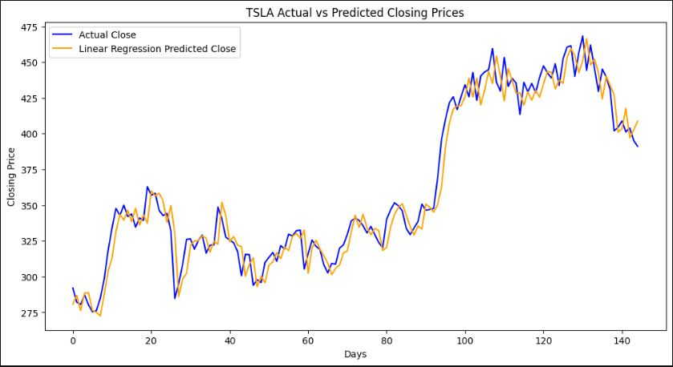

# 🚀 AI/ML Engineering Internship Portfolio
**DevelopersHub Corporation** **Author:** Tasawar Abbas Khan  

Welcome to my comprehensive Machine Learning and Artificial Intelligence portfolio! This repository showcases the end-to-end projects I engineered during my AI/ML Engineering Internship at **DevelopersHub Corporation**. 

The projects are divided into foundational Data Science tasks and advanced implementations involving Natural Language Processing (NLP), Transformer models, and production-ready ML pipelines.

---

## 🧠 Key Learnings & Professional Growth
Throughout this internship, I transitioned from theoretical concepts to practical, real-world AI engineering. My core professional takeaways include:
* **End-to-End Pipeline Architecture:** Mastered the ability to build, tune, and export robust machine learning pipelines (using Scikit-Learn and Joblib) that are ready for production deployment.
* **Advanced NLP & Transformers:** Gained hands-on experience fine-tuning state-of-the-art LLMs and BERT models for complex text classification and automated tagging systems.
* **Data Storytelling:** Enhanced my ability to not just clean data, but to extract actionable insights through Exploratory Data Analysis (EDA) and meaningful visualizations.
* **Problem-Solving & Evaluation:** Developed a strong intuition for selecting the right evaluation metrics (Accuracy, F1-Score, RMSE, MAE) based on the specific business problem.

---

## 📂 Project Categories & Full Details

### 🛠️ Phase 1: Foundational ML & Data Exploration
This phase focuses on core data wrangling, statistical analysis, and regression modeling.

#### 📊 Task 1: Iris Dataset Exploration
* **Objective:** Perform comprehensive Exploratory Data Analysis (EDA) to uncover underlying data distributions and feature relationships.
* **Methodology:** Loaded and cleaned data using Pandas. Engineered visual statistical summaries, including scatter plots for feature relationships and box plots for outlier detection.
* **Outcomes:** Successfully visualized multidimensional data boundaries and feature importance using `Seaborn` and `Matplotlib`.

#### 📈 Task 2: Short-Term Stock Price Prediction
* **Objective:** Forecast the next-day closing price of major stocks using historical market data.
* **Methodology:** Integrated the `yfinance` API to fetch real-time financial data. Handled time-series formatting and trained a predictive Regression model using features like Open, High, Low, and Volume.
* **Outcomes:** Developed a working time-series forecaster and visually plotted actual vs. predicted market trends to evaluate model reliability.
  

#### 🏠 Task 6: Real Estate House Price Prediction
* **Objective:** Predict continuous property values based on multi-variable features (size, bedrooms, location).
* **Methodology:** Applied extensive data preprocessing, handled missing values, and scaled numerical features. Trained a robust Linear Regression model.
* **Outcomes:** Evaluated the model's accuracy using precise business metrics: Mean Absolute Error (MAE) and Root Mean Squared Error (RMSE).

---

### 🚀 Phase 2: Advanced AI & MLOps
This phase tackles complex, real-world problems using deep learning, large language models, and automated pipelines.

#### 📰 Task 1: News Topic Classifier using BERT
* **Objective:** Build a robust NLP model to automatically categorize news headlines into distinct topics.
* **Methodology:** Tokenized text data and fine-tuned the pre-trained `bert-base-uncased` transformer model using the Hugging Face library. 
* **Outcomes:** Achieved high classification accuracy and F1-scores, demonstrating proficiency in transfer learning and modern NLP architectures.

#### ⚙️ Task 2: End-to-End Customer Churn ML Pipeline
* **Objective:** Create a reusable, production-ready system to predict which customers are likely to leave a telecommunications service.
* **Methodology:** Architected a Scikit-learn `Pipeline` to seamlessly handle scaling, encoding, and model training (Logistic Regression/Random Forest) in a single workflow. Utilized `GridSearchCV` for hyperparameter optimization.
* **Outcomes:** Successfully exported the fully trained pipeline as a `.pkl` file via `Joblib`, ensuring it is ready for immediate deployment in a live server environment.

#### 🎫 Task 5: Auto-Tagging Support Tickets with LLMs
* **Objective:** Automate customer support triage by categorizing free-text support tickets.
* **Methodology:** Leveraged Prompt Engineering techniques and Large Language Models (LLMs) to understand contextual user queries. Applied zero-shot and few-shot learning strategies to improve tagging accuracy without massive labeled datasets.
* **Outcomes:** Built an automated system capable of predicting the top 3 most probable category tags for unstructured text inputs.

---

## 💻 Technical Stack & Tools
* **Programming Language:** Python 3.x
* **Machine Learning:** Scikit-Learn, Hugging Face Transformers
* **Data Manipulation:** Pandas, NumPy
* **Data Visualization:** Matplotlib, Seaborn
* **Model Deployment & MLOps:** Joblib, Scikit-Learn Pipelines
* **Environment & Version Control:** Jupyter Notebooks, Git, GitHub

---
*Thank you for visiting my portfolio! Feel free to explore the individual folders to review the Jupyter Notebooks, datasets, and code architectures for each task.*
